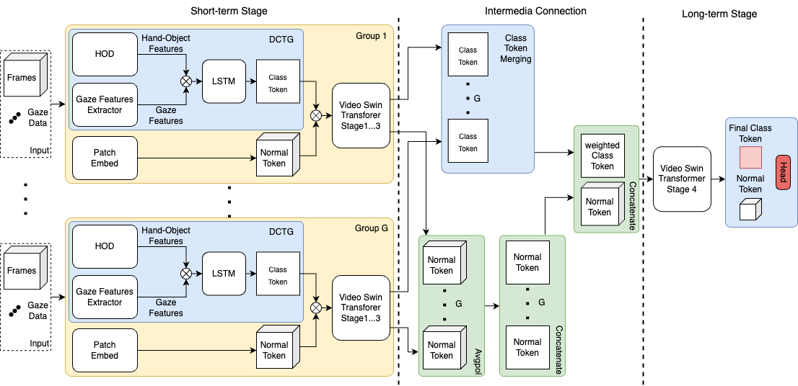

# Gaze Enhanced EgoViT
This code is the implementation of the master thesis ***Gaze-based Transformer for Improving Action Recognition in Egocentric Videos***.

## Introduction
This repo is a PyTorch implementation of Gaze Enhanced EgoViT (egocentric vision Transformer).

**The Gaze Enhanced EgoViT** builds upon the original EgoViT architecture by incorporating gaze information to improve egocentric action recognition. The EgoViT model, introduced by Pan in the paper [EgoViT: Pyramid Video Transformer for Egocentric Action Recognition](http://arxiv.org/abs/2303.08920), leverages a vision transformer structure to understand actions in egocentric video effectively. The Hand and Object Detector (HOD) module detects and identifies hands and objects that are being interacted with ind the scene. The detected hand and object information is processed through subsequent layers of the model, alongside the video frame data.

The Gaze Enhanced EgoViT extends this approach by incorporating gaze data, which provides additional context about the user’s focus within the scene. Gaze information is extracted using a Gaze Feature Extractor and then fused with the detected hand and object information. This enriched set of features is processed through subsequent layers of the model, improving performance in egocentric action recognition tasks. 

Figure 1 illustrates the structure of Gaze Enhanced EgoViT.

<!--
*Figure 1: Structure of Gaze Enhanced EgoViT*-->

  

  <em>Figure 1: Structure of Gaze Enhanced EgoViT</em>

This project uses a pretrained Hand-Object Detection (HOD) module,available at [hand-object detector](https://github.com/ddshan/hand_object_detector). The HOD module has been modified to extract hand-object features from input frames. Additionally, the Gaze Feature Extractor crops a gaze area around the gaze point and transforms the cropped image into gaze features. The extracted features are then merged into gaze-hand-object features, which are processed by an LSTM module to generate a class token for the transformer.

## Prerequisites
For the installation and usage of HOD, please refer to the [HOD README](https://github.com/ddshan/hand_object_detector/blob/master/README.md).

To set up the environment, create a conda environment named gazeEgoViT with Python 3.9, then install the following dependencies:
* PyTorch==2.2.0
* cuda==12.1
* torchvision==0.17.0
* opencv-python==4.10.0.82
* numpy==2.2.1
* pandas==2.2.1
* tqdm==4.66.4

## Train
### Data preparation
The dataset is stored in the `EGTEA_Gaze+` folder, which contains video clips and gaze tracking data. For more details about gaze data, refer to [gaze_readme.md](gaze_dataset/gaze_readme.md).

Use [GazeExtractor.py](gaze_preprocessing/GazeExtractor.py) to generate the gaze point coordinates for every video clip.

Use [run_hod.py](run.py) to save the sampled frames in videos and run the HOD module.

Execute [GazeFea_extractor_224.py](GazeFeatures/GazeFea_extractor_224.py) to extract the gaze features from frames. The input frames should have the size of 224x224.

Use [combin_data.py](GazeFeatures/combin_data.py) and [preprocess_data.py](transformer/preprocess_data.py) to create the training and testing datasets.

To train the mode, run [train.py](transformer/train.py). Alternatively, use [resume_training.py](transformer/resume_training.py) to train the model with the resume function.

## Test
To evaluate the model, run [test.py](transformer/test.py).

## About the model and dataset

The gaze enhanced EgoViT and its variant models are located in `EgoViT_swinb.py`.

Use the script [myDataset.py](transformer/myDataset.py) to build the custom dataset for gaze version 1 and [myDataset_v2.py](transformer/myDataset_v2.py) for gaze version 2.